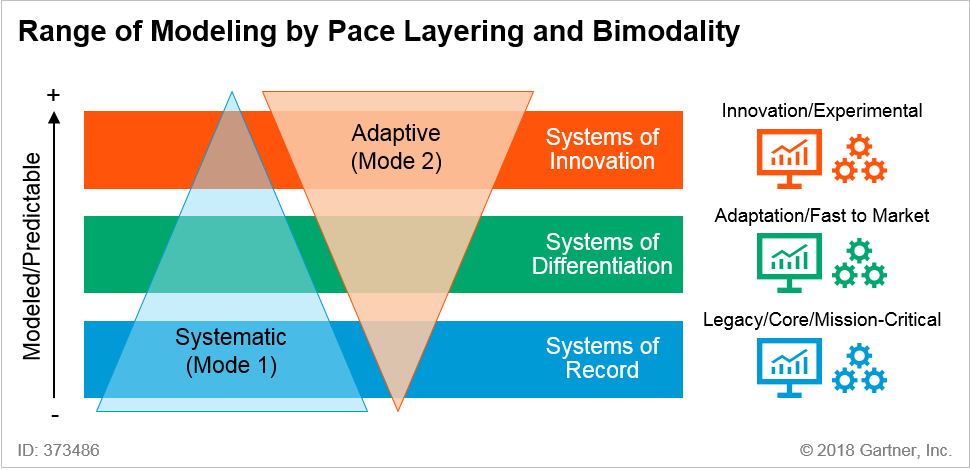

# Adopt a Bi-Modal Governance and Delivery

Bimodal is the practice of managing two separate but coherent styles of work: one focused on predictability; the other on exploration.

- **Mode 1** is optimized for areas that are more certain and well-understood.
  It focuses on exploiting what is known, while renovating the legacy environment into a state that is fit for a digital world.
- **Mode 2** is exploratory, experimenting to solve new problems, optimized for areas of uncertainty.
  These initiatives often begin with a hypothesis that is tested and adapted during a process involving short iterations.

The two different modes are there to offer two separate risk management techniques.
Where **risk = probability &#042; impact**, choosing to use one mode over the other depends on the risk entailed with the change proposed.

Legacy/Core/Mission-Critical systems benefit from Mode 1 governance that offers rigour and predictability.
Whereas Innovation and Experimental work benefit from Mode 2 governance where the solution is not yet known and a more iterative, discovery approach is to be used.

In general, if the change sought is close to the core of an organization where its impact can ripple across the organization, Mode 1 is used.
Whereas if a change sought is on the external boundary of an organization with little impact to the rest of the organization, Mode 2 is used.

To implement bimodal-aware governance, IITB will take these three steps:

1. Evolve existing IT governance arrangements to become bimodal-aware by establishing a single set of IT governance principles and roles that aligns priorities between both modes
2. Establish clear criteria for when Mode 2 needs to be involved over Mode 1.
   These criteria involve:
    - Financial control and reporting
    - Project Management
    - Software and Cloud procurement
    - Software release management
    - IT Security assessments
    - Standards compliance (e.g. web, accessibility, technology)
3. Rescope the IT standards for Mode 1 technologies only (e.g. development tools should be left to the developer community to choose and manage whereas)
4. Educate and build support for this single set of bimodal-aware IT governance principles and roles though existing IITB governance committees
